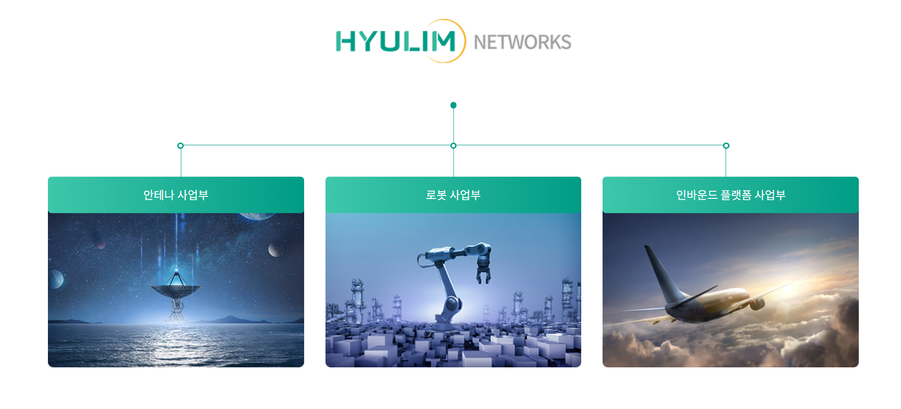
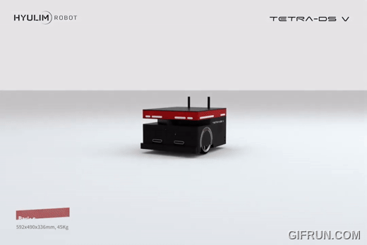
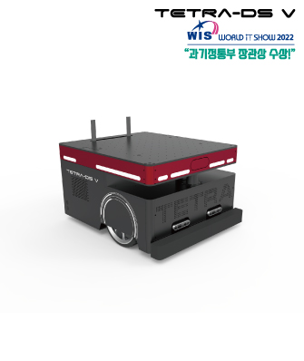
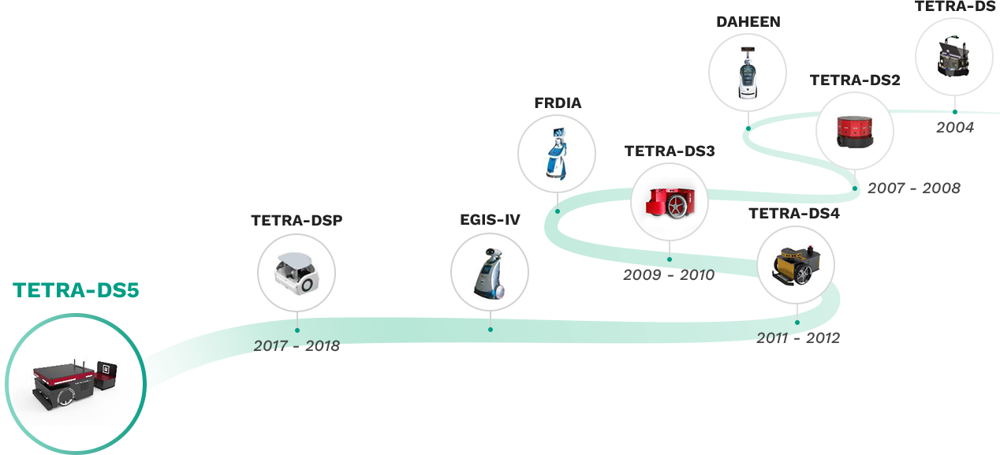

# 휴림 네트웍스 소개 

### 👋 항상 휴림네트웍스에 깊은 관심과 애정을 가져주셔서 진심으로 감사의 말씀 드립니다.

💻 Industry 4.0 시대를 맞아 로봇 기술과 이동통신 네트워크 기술의 트렌드는 빠르게 진화하고 있습니다. 5G의 등장은 디지털 프로세스의 거대한 변화를 주도하여 완전히 새로운 로봇 애플리케이션의 광범위한 플레이북을 열고, 서비스와 산업 등 모든 분야에 혁신적인 영향을 미칠 수 있는 잠재력을 가지고 있습니다.

🌈 휴림네트웍스는 이러한 혁신적인 '5G 특화망 기술'과 '프리미엄 지능형 로봇기술'을 융합함으로써, 산업 및 서비스의 효율성을 높이는 것은 물론
이용자의 안전과 수익을 향상시키고, 나아가 사회적 가치를 실현해 갈 수 있다고 확신합니다.

👩‍ 휴림네트웍스의 임직원들은 앞으로도 끊임없는 변화와 혁신을 통해, 5G 특화망과 로봇의 융합'을 통한 '기술과 기술', '사람과 기술', '사람과 사람'이
함께 공존하는 세상을 만들어갈 것을 약속 드립니다.

🙋‍ 휴림네트웍스는 1997년 설립이래 '5G 이동통신 기술'과 '로봇'이 융합된 첨단 AI 인프라 구축을 목표로 나아가고 있는 기업입니다.

🧙 5G 특화망 + 로봇' 기술과의 융합된 디지털 솔루션으로, 산업 및 의료, 서비스 등 다양한 분야에 적용해가고 있는 휴림네트웍스는 고객이 가장 신뢰할 수 있는
통신환경과 로봇 기술의 시너지로 사람과 로봇이 함께 공존하는 세상을 만들어 나가도록 최선을 다하겠습니다.

🍿휴림네트웍스의 경영이념은 기업활동의 목적으로서 '고객을 위한 가치창출', '혁신을 통한 창조'입니다. 고객을 최우선으로 생각하고, 구성원의 창의성과 자율을 존중하는 휴림네트웍스입니다.

- 휴림 네트웍스 [바로가기](http://www.hyulimnetworks.com)
- HerkuleX, Hovis [바로가기](http://hovis.co.kr/guide/)
- 휴림네트웍스 & AMR 소개자료 [다운로드](https://raw.githubusercontent.com/Hyulim-Networks/.github/main/profile/docs/intro/휴림네트웍스 & AMR 소개자료 241202.pdf) - [미리보기](./docs/intro/휴림네트웍스 & AMR 소개자료 241202.pdf)

 

 

# 테트라 소개

## TETRA-DS V

- 다양한 환경 및 고객 Needs를 반영할 수 있는 '맞춤형 AMR' (Autonomous Mobile Robot, 자율주행로봇)

- TETRA-DSV는 다양한 현장 환경과 고객 Needs를 반영할 수 있는 '맞춤형 AMR'(Autonomous Mobile Robot, 자율주행로봇)입니다. 

- 지난 10여년 간의 지속적 연구개발을 통해 완성한 AMR로, 고도화된 자율주행 기술 탑재 및 원격관제 서비스를 제공합니다.

- TETRA-DSV는 다양한 Application으로 발전 가능한 확정성을 위해 범용성 로봇 운영 체제인 [ROS](https://www.ros.org/)기반으로 개발되었습니다. 

- Payload는 120kg까지 적재할 수 있으며, 1회 충전으로 8시간 운영이 가능하여 물류창고, 제조공장 및 일반 실내공간에서도 그 활용성을 인정받고 있습니다. 

- 특히, PC 또는 모바일 기기를 통해 사용자가 손쉽게 통제관제 및 운영할 수 있습니다. 
(테트라는 [우분투 18.04](https://releases.ubuntu.com/18.04/)를 이용합니다.)

### 테트라 사양서 📜
- 테트라 M 사양서: [다운로드](https://raw.githubusercontent.com/Hyulim-Networks/.github/main/profile/docs/spec/m/TETRA_DSV_M_specifications_241029.pdf) - [미리보기](./docs/spec/m/TETRA_DSV_M_specifications_241029.pdf)
- 테트라 S 사양서: [다운로드](https://raw.githubusercontent.com/Hyulim-Networks/.github/main/profile/docs/spec/s/TETRA_DSV_S_specifications_241029.pdf) - [미리보기](./docs/spec/s/TETRA_DSV_S_specifications_241029.pdf)
 

### 테트라 Control Hardware Protocol 매뉴얼 ⚡
- 테트라 Control Hardware Protocol 매뉴얼: [다운로드](https://raw.githubusercontent.com/Hyulim-Networks/.github/main/profile/docs/protocol/TETRA_DSV_control_hardware_protocol_241029.pdf) - [미리보기](./docs/protocol/TETRA_DSV_control_hardware_protocol_241029.pdf)
 

### 테트라 ROS 매뉴얼 🤖
- 테트라 ROS Melodic 매뉴얼: [다운로드](https://raw.githubusercontent.com/Hyulim-Networks/.github/main/profile/docs/ros/TETRA_DSV_ros_melodic_menual_241029.pdf) - [미리보기](./docs/ros/TETRA_DSV_ros_melodic_menual_241029.pdf)
 

### 테트라 Back-End 매뉴얼 💻
- 테트라 REST API 문서: [다운로드](https://raw.githubusercontent.com/Hyulim-Networks/.github/main/profile/docs/restapi/tetra_single_api_20241024.pdf) - [미리보기](./docs/restapi/tetra_single_api_20241024.pdf)
- 테트라 REST API 예시: [바로가기](./docs/restapi/ex_20241029.md)
- 테트라 Web Socket 매뉴얼: [바로가기](./docs/websocket/websocket_20241029.md)
 

### 테트라 App 매뉴얼 📱
- 테트라 싱글관제 매뉴얼: [다운로드](https://raw.githubusercontent.com/Hyulim-Networks/.github/main/profile/docs/app/TETRA-DSV_Controller_Manual_v241028.pdf) - [미리보기](./docs/app/TETRA-DSV_Controller_Manual_v241028.pdf)
 

### 테트라 App ▶️
- 테트라 APK: [다운로드](https://raw.githubusercontent.com/Hyulim-Networks/.github/main/profile/app/tetra_single_controller.apk)
 

